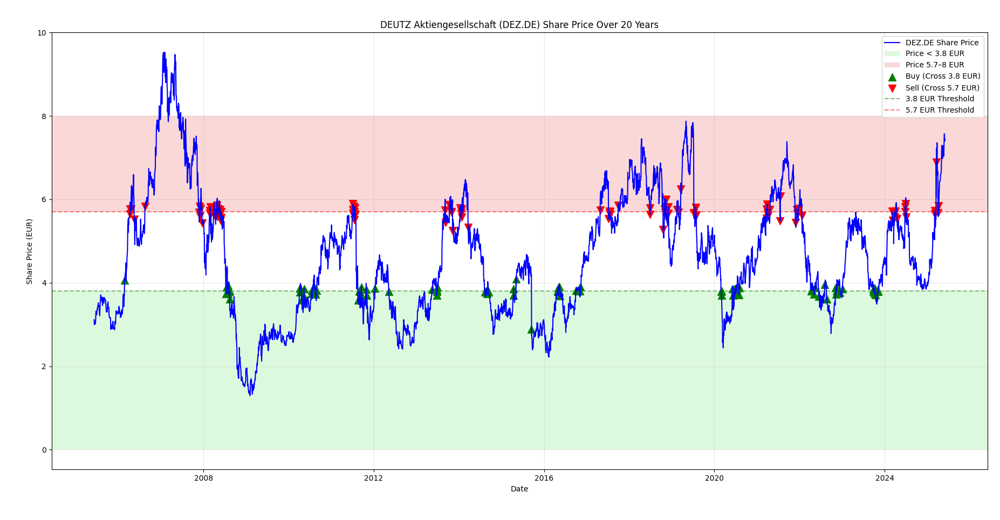

The case of Deutz
=================

In this manual the stock value of Deutz is used, mainly because it fluctuates and has some periodicity. 

Deutz AG
========

Overview
--------

Deutz AG is a German manufacturer of internal combustion engines. The company was founded in 1864 by Nicolaus Otto, who invented the four-stroke engine. Deutz AG is headquartered in Cologne, Germany, and is known for its innovation and engineering excellence in the production of diesel and gas engines.

The company operates in various sectors, including agriculture, construction, material handling, and stationary equipment. Deutz engines are recognized for their reliability, efficiency, and compliance with stringent emission standards.

Share Information
-----------------

Deutz AG is publicly traded on the Frankfurt Stock Exchange under the ticker symbol `DEZ`. The company’s shares are included in the SDAX index, which lists small capitalization companies in Germany.

Key highlights about Deutz AG shares:
- **Ticker Symbol**: DEZ
- **Exchange**: Frankfurt Stock Exchange
- **Index**: SDAX

Investors consider Deutz AG a stable investment due to its long history, strong market position, and continuous innovation in the engine manufacturing industry.

Useful Links
------------

- `Deutz AG Official Website <https://www.deutz.com>`_
- `Deutz AG Investor Relations <https://www.deutz.com/en/investor-relations/>`_

